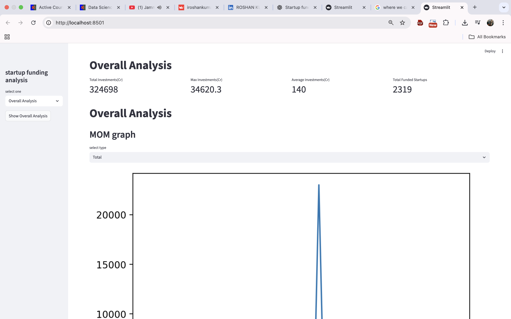
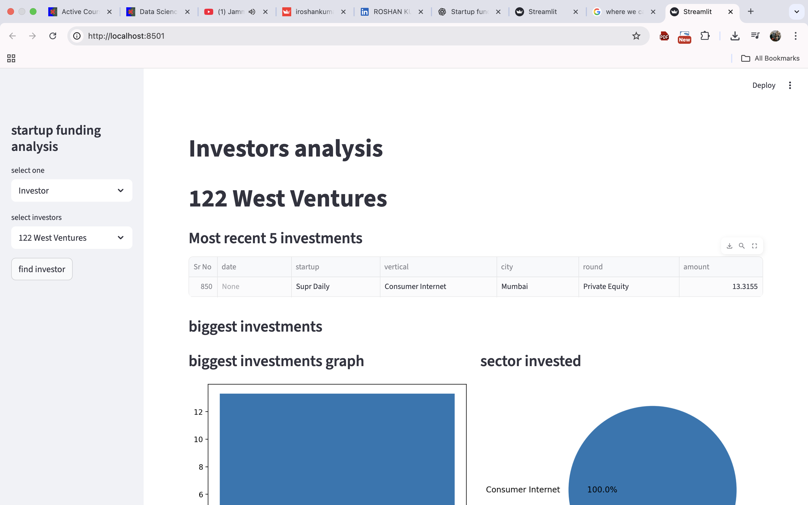
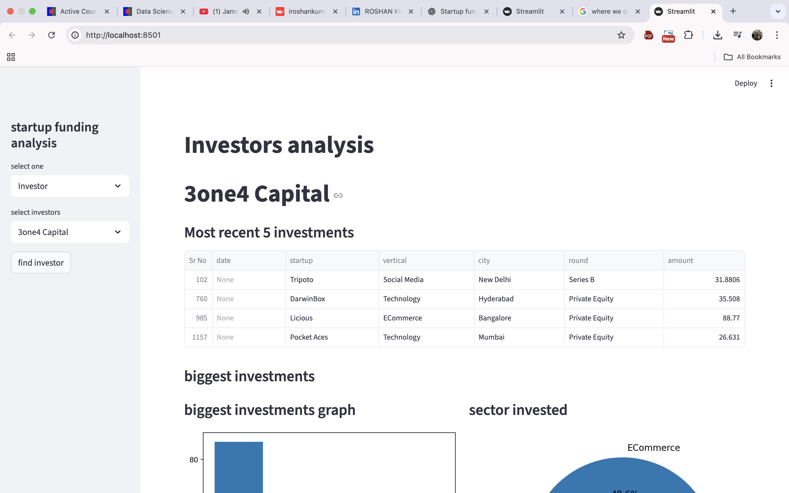
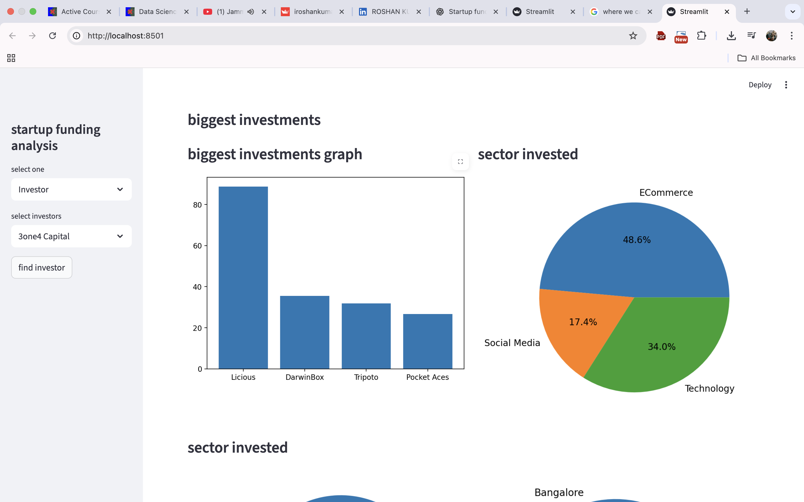
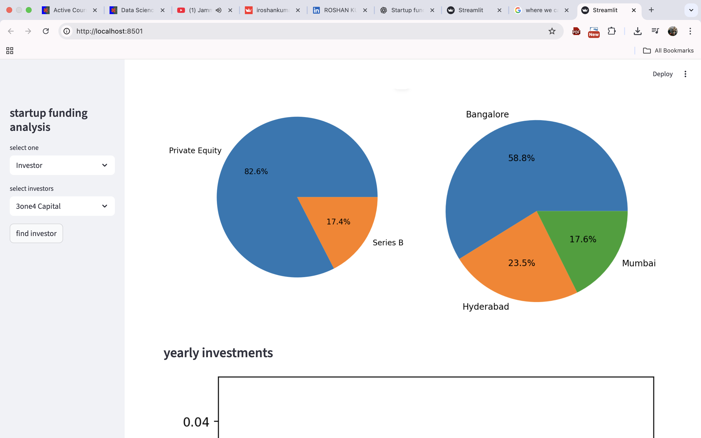

🚀 Startup Funding Analysis Dashboard
Built with Streamlit | Python | Pandas | Matplotlib

This project provides an interactive dashboard to analyze Indian startup funding trends.
It helps visualize investment patterns, top startups, investor activities, funding rounds, heatmaps, and more — all using Streamlit.

📌 Project Features
🔍 1. Overall Funding Analysis

Total funding invested (in Crores)

Maximum investment in a single startup

Average funding per startup

Total number of funded startups

Month-on-Month funding trend

📊 2. Funding Type Analysis

Top funding rounds by total investment

Pie chart showing round-wise % share

🏙️ 3. City-wise Funding

Top cities receiving funding

Bar chart visualization

🏆 4. Top Startups Analysis

Overall top funded startups

Year-wise top startups

Interactive charts

💰 5. Top Investors Analysis

Investors ranked by investment amount

Proper handling of multiple investors per deal

Bar chart visualization

🔥 6. Funding Heatmap

Year vs Month heatmap

Helps visualize funding seasonality

🧪 7. Startup-wise Breakdown

Startup funding timeline

Investments by rounds

Table of all funding activity

🏦 8. Investor-wise Breakdown

Recent 5 investments

Biggest investments

Sector-wise breakdown

Round-wise & city-wise funding distribution

Year-on-Year investing trend

📂 Project Structure
startup-funding-analysis/
│── app.py                 # Main Streamlit application
│── 1startup_funding.csv   # Raw dataset
│── startup cleaned.csv    # Cleaned dataset generated by script
│── README.md              # Project documentation
│── requirements.txt       # Dependencies

🛠️ Tech Stack
Component	Technology
Frontend	Streamlit
Backend Logic	Python
Data Cleaning	Pandas, NumPy
Visualizations	Matplotlib, Seaborn
Dataset	Indian Startup Funding CSV
🚀 Getting Started
1. Clone the Repository
git clone https://github.com/iroshankumar/startup-funding-analysis.git
cd startup-funding-analysis

2. Install Dependencies

Create a requirements.txt containing:

streamlit
pandas
numpy
matplotlib
seaborn

Then install:

pip install -r requirements.txt

3. Run the App
streamlit run app.py

📊 Dataset Information

The dataset contains the following fields:

Date

Startup Name

Industry Vertical

Sub-Vertical

City

Investors Name

Investment Type

Amount (USD)

Cleaning includes:

Removing irrelevant columns

Fixing null values

Normalizing text

Converting USD → INR (Cr)

Fixing date formats

Splitting multiple investors

🧼 Data Cleaning Performed

✔ Filled missing investor names as "Undisclosed"
✔ Dropped unused columns
✔ Removed non-numeric and unknown amounts
✔ Converted amounts into INR Crores
✔ Fixed date parsing issues
✔ Extracted year & month
✔ Saved cleaned dataset for reuse

📸 Dashboard Screenshots

🌐 Deployment (Optional)

You can deploy this project on:

Streamlit Cloud

AWS EC2

Render

Railway

I can also help you deploy it if needed.

🤝 Contributions

Contributions are welcome! Feel free to open issues or submit PRs.

⭐ Give the Project a Star

If you found this useful, please star ⭐ the repository!